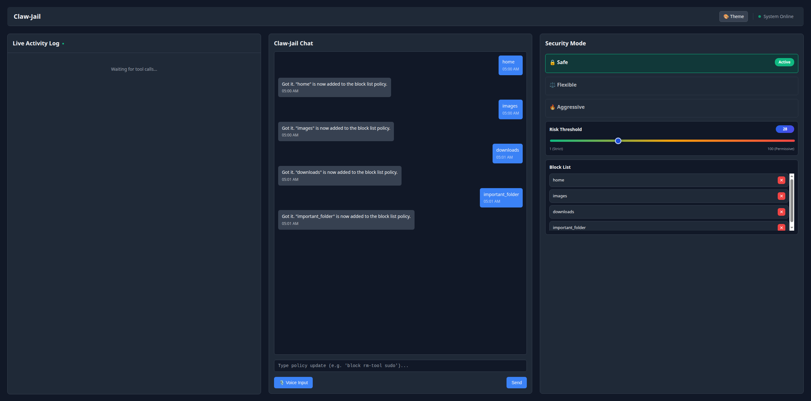

# Claw-Jail 🔒

A real-time security middleware dashboard for monitoring and controlling what OpenClaw does on your system.



## What It Does

Claw-Jail operates as a security middleware layer between the AI agent and the host system. It acts as a digital "black box" that monitors an AI's internal chain of thought and planned actions in real-time. Through a live dashboard, it ensures the agent never executes malicious commands or exceeds its authorization without oversight.

- **Keyword Watchlist:** Input specific keywords or phrases to monitor. Any matching action is automatically flagged.
- **Risk Scoring:** Every tool OpenClaw attempts to run is instantly assigned a risk score from 1–100.
- **Threshold Slider:** Set your security tolerance. If an action's risk score exceeds the threshold, OpenClaw's execution is paused and the user must manually approve or reject it the current tool that the agent is attempting to run.
- **Human-in-the-Loop:** A definitive safety gate before OpenClaw is permitted to continue its task.
- **Light, Cream, and Dark Mode:** Clean dashboard with theme selection.

---

## How It Works (The Security Pipeline)

1. **OpenClaw Interface:** The React-based UI where users issue commands like "fix this bug", "run this command", or "create hello_world.txt" for example.
2. **Gateway (Middleman):** Intercepts all commands and manages flow between the UI and the underlying agent.
3. **Agent (OpenClaw):** Receives instructions from the gateway and asks the LLM to generate the logic behind the command.
4. **Pluggin (The Jail):** Before the agent executes any logic, the pluggin captures the tool and runs it against the risk checker. If it goes above the threshold, it lets the users approve or reject the tool within the log area. This allows the user to decide if OpenClaw should run it or not.
5. **Security Dashboard:** The FastAPI backend pushes every intended action to the dashboard, which logs it, scores it, and applies security rules. The user, such as an IT Manager, oversees this process and can modify rules as needed.
6. **Bash Terminal:** Only after passing the gateway and human-governed security rules does the action reach the terminal for final execution.

---

## Tech Stack

| Layer | Technology |
|---|---|
| Frontend | React + Vite |
| Backend | Python + FastAPI |
| Infrastructure | Docker + GitHub Actions (CI) |
| AI Agent | OpenClaw |
| Voice Input | Wispr Flow |
| Risk Assessment | Gemini 1.5 Flash |
| Real-Time Comms | WebSockets |

---

## Challenges

- **Intercepting agent internals** is hard! Our first proxy/shim approach failed because raw commands to OpenClaw's internal LLM weren't visible, and documentation was sparse. We pivoted to a **custom log-interception plugin** that hooks directly into the tool-execution pipeline, capturing intent before it becomes action.
- **Real-time data transfer** required learning and implementing WebSockets to maintain a persistent connection between the frontend and backend.

---

## Running with Docker (Recommended)

### Prerequisites
- [Docker](https://docs.docker.com/get-docker/)
- [Docker Compose](https://docs.docker.com/compose/install/)

### Start Everything

```bash
docker compose up --build -d
```

- Frontend: `http://localhost:5173`
- Backend API: `http://localhost:8000`
- FastAPI Docs (Swagger): `http://localhost:8000/docs`

### Stop Everything

```bash
docker compose down
```

### Full Clean Reset (wipe volumes + rebuild from scratch)

```bash
docker compose down -v
docker compose up --build --no-cache -d
```

> Use this after pulling new changes from teammates to ensure your images and containers are fully in sync.

### View Logs

```bash
# All services
docker compose logs -f

# Specific service
docker compose logs -f backend
docker compose logs -f frontend
```

---

## Local Development (Without Docker)

### Frontend (React + Vite)

**Prerequisites:** Node.js 18+

```bash
cd frontend
npm install
npm run dev
```

Frontend will be available at `http://localhost:5173`

---

### Backend (FastAPI + Uvicorn)

**Prerequisites:** Python 3.12+

```bash
cd backend
python3 -m venv venv
source venv/bin/activate        # Windows: venv\Scripts\activate
pip install -r requirements.txt
uvicorn app.main:app --reload
```

Backend API will be available at `http://localhost:8000`

**Interactive API Docs:** `http://localhost:8000/docs`

#### Each time you return to work on the backend:

```bash
cd backend
source venv/bin/activate
uvicorn app.main:app --reload
```

To deactivate when done:

```bash
deactivate
```

---

## Environment Variables

Copy the example env file and fill in your values:

```bash
cp backend/.env.example backend/.env
```

---

## Git Ignored Folders

This repository intentionally does **not** track the following:

| Path | Reason |
|---|---|
| `venv/`, `.venv/`, `backend/venv/` | Python virtual environments |
| `__pycache__/`, `*.pyc` | Python bytecode cache |
| `node_modules/`, `frontend/node_modules/` | Node dependencies |
| `frontend/dist/`, `frontend/dist-ssr/` | Frontend build output |
| `backend/.env` | Secrets and API keys |

If these appear in Git, remove them from tracking before pushing:

```bash
git rm -r --cached node_modules
git rm -r --cached backend/venv
git commit -m "remove ignored files from tracking"
```

---

## What's Next

- Polish the dashboard with more monitoring components
- Add more granular security rules per tool type
- Allow for a wider range of commands to be inputed
- Add a settings area with more modes/presets
- Use a strong voice detection model
- More accessibility features
  - Color blind users
  - Near-sighted users
